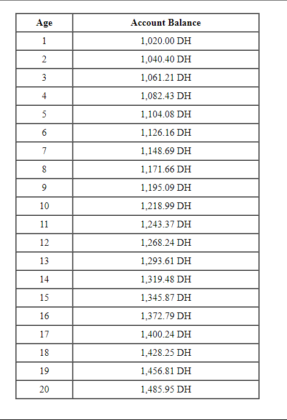

## Description
This repository contains a PHP script that calculates and displays the growth of a savings account over 20 years. The account starts with an initial deposit of 1000 DH and earns an annual interest rate of 2%. The script generates an HTML table showing the account balance for each year, starting from year 1 to year 20. 

## Screenshot

